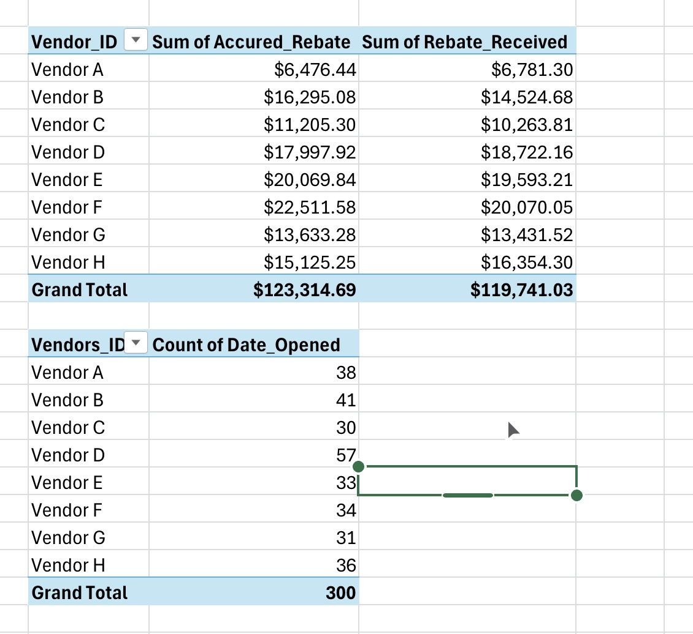

# Vendor Rebate & Accrual Analysis

## Project Overview
This project analyzes vendor rebate and accrual data for 300 vendors across eight suppliers. The PDF workbook is organized with clear headers, formulas, and charts to summarize payments, track KPIs, and identify trends.

## Files Included
- **`Vendor_Project_Official.pdf`** – PDF containing all raw and analyzed data, calculations, charts, and pivot tables.

## Key Features
- Clean, organized dataset with clear column headers
- Basic calculations for totals, differences, and percentages
- Charts visualizing rebate and accrual trends
- Easy-to-navigate document for reviewing vendor data

## Professional Insights
- Demonstrates advanced Excel and data analysis skills, including clean organization, formulas, charts, and pivot tables
- Provides actionable insights into vendor performance and rebate trends
- Highlights ability to summarize and communicate financial information clearly

## Visuals
- For a quick overview of the analysis, a single pivot table screenshot is included in this repository. It summarizes key insights across vendors, product categories, rebates, and order counts.  
    
  > **Note:** The full PDF (`Vendor_Project_Official.pdf`) contains all pivot tables, charts, and detailed summaries for in-depth review.
